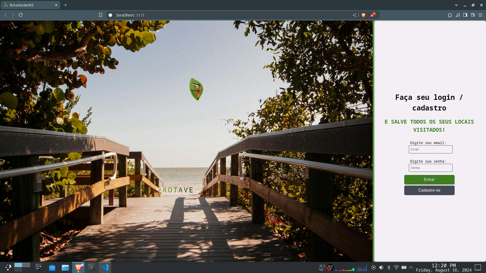
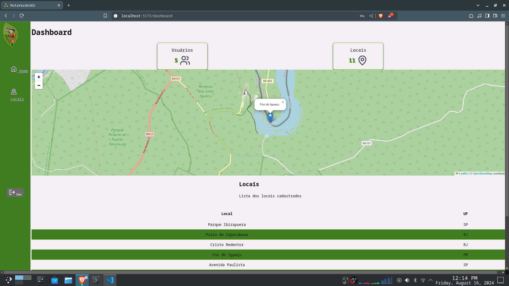

# Rotaverde365

Rotaverde365 é uma aplicação para registrar e gerenciar os locais que você visitou, como trilhas, passeios, praias e outros pontos de interesse. Organize suas aventuras e mantenha um histórico das suas explorações.

## Funcionalidades

- **Registro de Locais**: Adicione e armazene informações sobre trilhas, passeios, praias e outros locais visitados.
- **Visualização**: Veja os locais registrados em um mapa interativo.
- **Formulários de Entrada**: Preencha informações sobre os locais visitados utilizando formulários intuitivos.
- **Filtros e Pesquisa**: Encontre rapidamente os locais salvos com opções de filtragem e pesquisa.

## Tecnologias Utilizadas

- **React**: Biblioteca para construção da interface de usuário.
- **Vite**: Ferramenta de build para desenvolvimento rápido e eficiente.
- **React-Leaflet**: Integração do Leaflet para exibição de mapas interativos.
- **Yup**: Validação de formulários.
- **React Hook Form**: Gerenciamento de formulários.
- **ESLint**: Linter para garantir a qualidade do código.
- **Leaflet**: Biblioteca para mapas interativos.

## Pré-Requisitos

Certifique-se de ter o [Node.js](https://nodejs.org/) instalado em sua máquina.

## Instalação

1. Clone o repositório:

    ```bash
    git clone <URL-do-repositório>
    ```

2. Navegue para o diretório do projeto:

    ```bash
    cd rotaverde365
    ```

3. Instale as dependências:

    ```bash
    npm install
    ```

## Scripts

- **`npm run dev`**: Inicia o servidor de desenvolvimento.
- **`npm run build`**: Cria uma versão otimizada para produção.
- **`npm run lint`**: Executa a análise de código com ESLint.
- **`npm run preview`**: Visualiza a versão de produção localmente.
- **`npm run server`**: Inicia um servidor JSON local para simular uma API.

## Capturas de Tela

Veja abaixo duas capturas de tela da aplicação:





---

Obrigado por usar o Rotaverde365. Esperamos que você aproveite sua experiência e encontre muitos locais incríveis!
